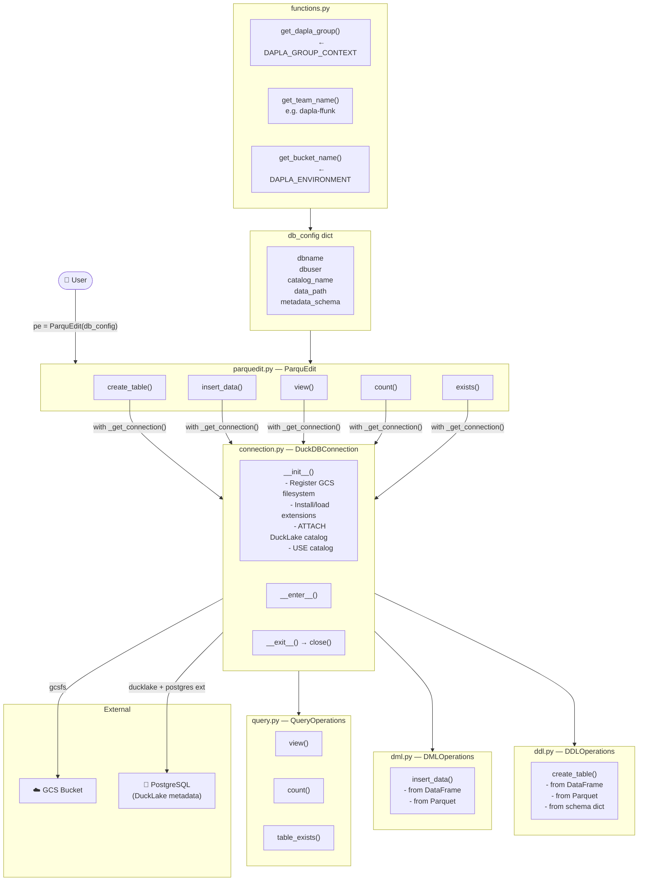

# SSB Parquedit

[][pypi status]
[][pypi status]
[][pypi status]
[][license]

[][documentation]
[][tests]
[][sonarcov]
[][sonarquality]

[][pre-commit]
[][black]
[](https://github.com/astral-sh/ruff)
[][poetry]

[pypi status]: https://pypi.org/project/ssb-parquedit/
[documentation]: https://statisticsnorway.github.io/ssb-parquedit
[tests]: https://github.com/statisticsnorway/ssb-parquedit/actions?workflow=Tests
[sonarcov]: https://sonarcloud.io/summary/overall?id=statisticsnorway_ssb-parquedit
[sonarquality]: https://sonarcloud.io/summary/overall?id=statisticsnorway_ssb-parquedit
[pre-commit]: https://github.com/pre-commit/pre-commit
[black]: https://github.com/psf/black
[poetry]: https://python-poetry.org/

## Features

- TODO TO DONT

## Requirements

- TODO

## Installation

You can install _SSB Parquedit_ via [pip] from [PyPI]:

```console
pip install ssb-parquedit
```

## Flowchart


## Usage

Please see the [Reference Guide] for details.

## Contributing

Contributions are very welcome.
To learn more, see the [Contributor Guide].

## License

Distributed under the terms of the [MIT license][license],
_SSB Parquedit_ is free and open source software.

## Issues

If you encounter any problems,
please [file an issue] along with a detailed description.

## Credits

This project was generated from [Statistics Norway]'s [SSB PyPI Template].

[statistics norway]: https://www.ssb.no/en
[pypi]: https://pypi.org/
[ssb pypi template]: https://github.com/statisticsnorway/ssb-pypitemplate
[file an issue]: https://github.com/statisticsnorway/ssb-parquedit/issues
[pip]: https://pip.pypa.io/

<!-- github-only -->

[license]: https://github.com/statisticsnorway/ssb-parquedit/blob/main/LICENSE
[contributor guide]: https://github.com/statisticsnorway/ssb-parquedit/blob/main/CONTRIBUTING.md
[reference guide]: https://statisticsnorway.github.io/ssb-parquedit/reference.html
